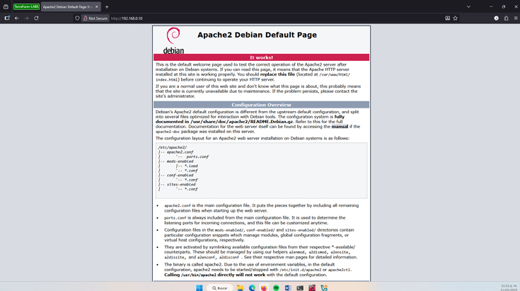

## Características del servidor VM
- Nombre: web_frutas
- SO: Debian 12
- Almacenamiento: 20GB
- RAM: 2048MB (4GB)
# Instalación y Configuración del Web Server

Primero pasaremos a actualizar los paquetes del servidor e instalaremos los siguientes paquetes:

- **Apache2:** Se encarga de recibir las peticiones HTTP/HTTPS de los usuarios y entregar las páginas que correspondan. 
- **php:** Es el lenguaje de programación del lado del servidor que genera contenido dinámico. PHP se ejecuta en el servidor (no en el navegador) y puede conectarse con bases de datos, procesar formularios, manejar sesiones, etc. 
- **php-mysql: **Es el módulo de conexión entre PHP y MariaDB/MySQL.  libapache2-mod-php: Es el módulo que integra PHP dentro de Apache. 
- **Mariadb-client:** Es el cliente de línea de comandos para conectarse a servidores MariaDB (locales o remotos). No instala un servidor de base de datos, solo las herramientas necesarias para conectarse y ejecutar comandos SQL.

```bash
sudo apt update -y
```

```bash
sudo apt install apache2 php php-mysql libapache2-mod-php mariadb-client -y
```

## Paso 1 - Conexión con la base de datos
Ahora comprobaremos que haya conexión con la base de datos utilizando el usuario previamente creado en ella.

```bash
mysql -u erp_user -p1234 -h<ip_del_servidor_db> -e "SHOW DATABASES;"
```

## Paso 2 - Servicio de apache2
Ahora procederemos a habilitaremos el servicio web apache y comprobaremos que esté funcionando en el navegador.

Primero habilitamos el servicio para que inicie con el servidor.
```bash
sudo systemctl enable apache2
```

Iniciamos el servicio
```bash
sudo systemctl start apache2
```

Por ultimo verificamos que el servicio este corriendo, nos debe mostrar `Active (Running)`
```bash
sudo systemctl status apache2
```

Por ultimo verificaremos en el navegador introduciendo la ip del servidor web, en este caso es la `192.168.0.10`

![[Pasted image 20260120162606.png]]



## Paso 3 - Creación de aplicación web de prueba
Ahora crearemos una aplicación web de prueba para ver la funcionalidad de la conexión con el servidor de la base de datos. 

Para esto creamos un fichero en /var/www/html/ el cual le pondremos de nombre testdb.php.
```php
<?php

$servername = "ip_db_frutas";

$username = "erp_user";

$password = "1234";

$dbname = "ERP_Frutas";

  

$conn = new mysqli($servername, $username, $password, $dbname);

if ($conn->connect_error) {"Error: " . $conn->connect_error(); }

  

echo "Conexion exitosa a la base de datos ERP_Frutas<br>";

  

$result = $conn->query("SELECT * FROM clientes");

while ($row = $result->fetch_assoc()) {

    echo $row["nombre"] . " - " . $row["email"] . "<br>";

}

  

$conn->close();

?>
```

El resultado sería poder ver los registros de la tabla clientes y una confirmación de una correcta conexión a la base de datos.

![[Pasted image 20260120163556.png]]

Por ultimo en el servidor web realizaremos algunas configuraciones de seguridad. Editaremos el fichero `apache2.conf` en la ruta `/etc/apache2/` y verificamos que en el parámetro options este asignado a `FollowSymLinks.`

![[Pasted image 20260120165306.png]]

## Paso 4 - Instalación de firewall
También instalaremos el firewall `ufw` para asegurar el servidor web

```bash
sudo apt install ufw -y
```

Una vez instalado el firewall `ufw` pasaremos a configurar la conexión con los puertos necesarios para este servidor.

```bash
sudo ufw allow OpenSSH
sudo ufw allow 80/tcp
sudo ufw allow 443/tcp
```


